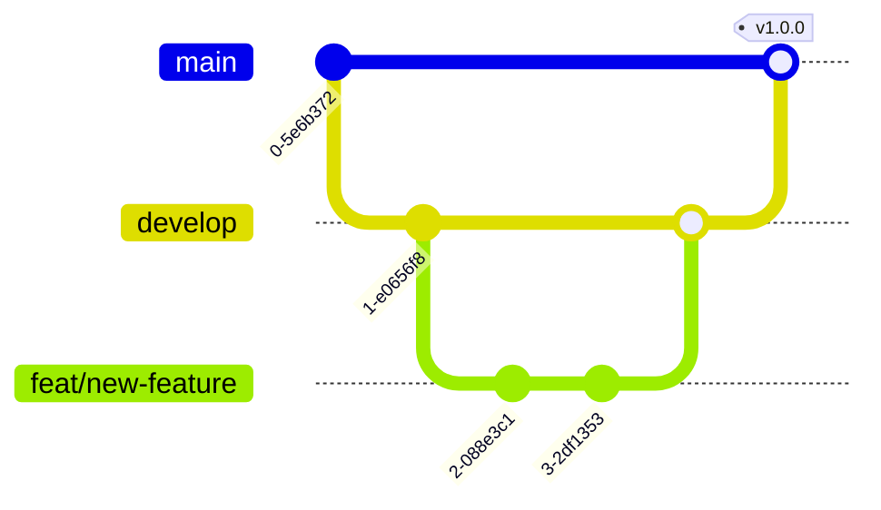

# Contributing Guide

Thanks for your interest in contributing to **[NOMBRE_DEL_PROYECTO]**! This guide describes the workflow, code standards, and Pull Request process.

## Table of Contents

- [Environment Setup](#environment-setup)
- [Workflow](#workflow)
- [Code Standards](#code-standards)
- [Commits and Messages](#commits-and-messages)
- [Pull Requests](#pull-requests)
- [Code Review](#code-review)
- [Testing](#testing)

## Environment Setup

Follow the installation instructions in the [README](README.md#installation). Make sure the tests pass locally before you start working.

## Workflow

We use a simplified **Git Flow**.

### Branching Strategy

| Branch     | Purpose                              | Source    | Target             |
| ---------- | ------------------------------------ | --------- | ------------------ |
| `main`     | Production code. Always stable.      | —         | —                  |
| `develop`  | Feature integration. Pre-release.    | `main`    | `main`             |
| `feat/*`   | New feature.                         | `develop` | `develop`          |
| `fix/*`    | Non-urgent bug fix.                  | `develop` | `develop`          |
| `hotfix/*` | Urgent production fix.               | `main`    | `main` & `develop` |
| `docs/*`   | Documentation-only changes.          | `develop` | `develop`          |
| `chore/*`  | Maintenance, tooling, configuration. | `develop` | `develop`          |



### Feature flow

```bash
# 1. Start from an up-to-date develop
git checkout develop
git pull origin develop

# 2. Create your branch
git checkout -b feat/descriptive-name

# 3. Work and commit (see format below)
git add .
git commit -m "feat: add X"

# 4. Push your branch and open a PR against develop
git push origin feat/descriptive-name
```

### Hotfix flow

Hotfixes branch from `main`, merge into `main`, and are then synced into `develop`.

```bash
git checkout main
git pull origin main
git checkout -b hotfix/fix-description
# ... fix + commit ...
git push origin hotfix/fix-description
```

### Branch naming

- Lowercase, with a type prefix and a `kebab-case` description: `feat/google-login`, `fix/payment-timeout`, `docs/update-readme`.

### Branch policies

- `main` and `develop` are protected: no direct pushes, only via approved PR.
- Keep your branch up to date with `develop` (rebase or merge) before opening the PR.

## Code Standards

### Formatting

- Indentation and style defined by [`.editorconfig`](.editorconfig) and the project's linter.
- Lines of at most [LONGITUD_LÍNEA] characters.
- UTF-8 encoding, LF line endings.

### Naming

- Follow the idiomatic conventions of [RUNTIME] (e.g. `camelCase`/`snake_case`/`PascalCase` as appropriate).
- Descriptive names; avoid cryptic abbreviations.

### Comments

- Comment the _why_, not the _what_. The code should be self-explanatory.
- Document non-obvious decisions and link to the corresponding ADR when applicable.

## Commits and Messages

We use [Conventional Commits](https://www.conventionalcommits.org/en/v1.0.0/):

```
<type>(<optional scope>): <short imperative description>

<optional body>

<optional footer: BREAKING CHANGE, Closes #123>
```

Common types: `feat`, `fix`, `docs`, `style`, `refactor`, `perf`, `test`, `build`, `ci`, `chore`.

Examples:

```
feat(auth): add login with Google
fix(api): fix timeout on the payments endpoint
docs: update the installation guide
```

## Pull Requests

- Use the [PR template](.github/PULL_REQUEST_TEMPLATE.md) (it loads automatically).
- One PR per logical change; keep them small and focused.
- Link related issues (`Closes #123`).
- Make sure CI passes (tests, linting, build).

## Code Review

**As an author:**

- Self-review before requesting review.
- Respond to comments and mark conversations as resolved.

**As a reviewer:**

- Be respectful and specific; suggest, don't impose.
- Check correctness, readability, tests, and potential regressions.

## Testing

- Accompany every functional change with tests.
- Run the full suite before opening the PR ([COMANDO_TEST]).
- Follow the [testing conventions](docs/conventions/testing.md).
