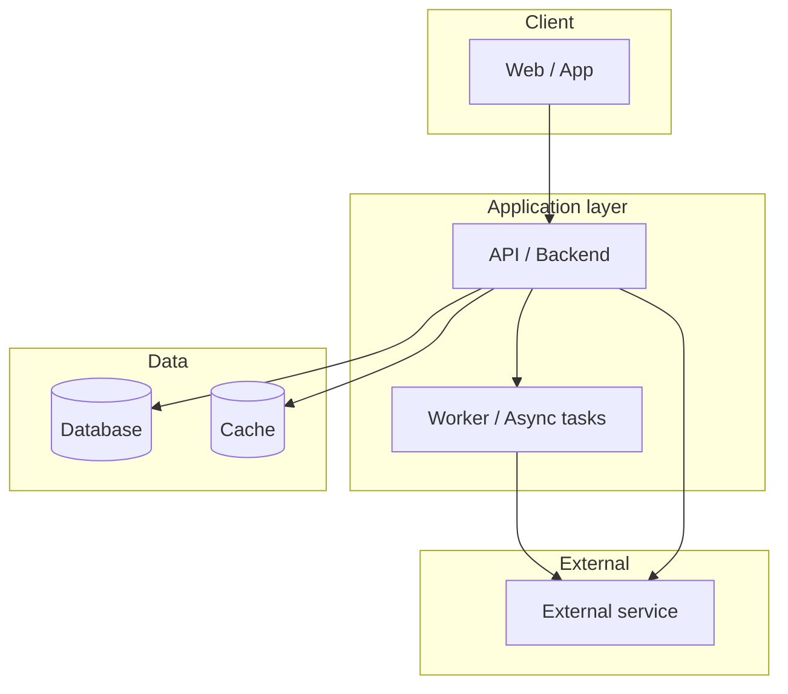
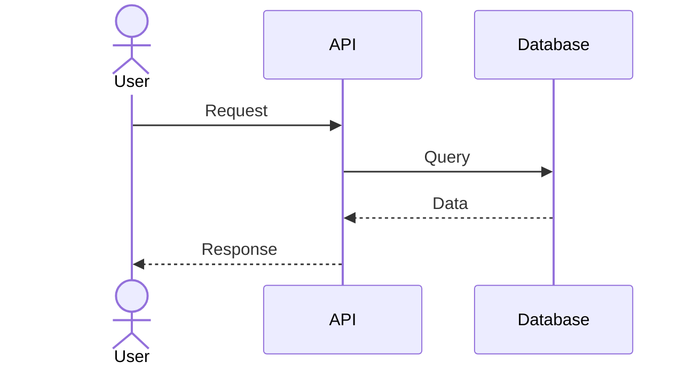

# [NOMBRE_DEL_PROYECTO] — Architecture

> High-level view of how the system is built and how responsibilities are
> distributed. For the actual stack (versions, libraries) see
> [`stack.md`](stack.md). For the business see
> [`../product/business-model.md`](../product/business-model.md).
>
> **Last updated**: [FECHA]

## Diagram

## Components

| Component      | Responsibility                                | Technology   |
| -------------- | --------------------------------------------- | ------------ |
| [COMPONENTE_1] | [What it does and what it is responsible for] | [TECNOLOGÍA] |
| [COMPONENTE_2] | [What it does and what it is responsible for] | [TECNOLOGÍA] |
| [COMPONENTE_3] | [What it does and what it is responsible for] | [TECNOLOGÍA] |

## Key decisions

| Decision     | Reason            |
| ------------ | ----------------- |
| [DECISIÓN_1] | [Why it was made] |
| [DECISIÓN_2] | [Why it was made] |

> The detail and alternatives for each relevant decision are recorded as
> ADRs in [`../decisions/`](../decisions/README.md).

## Non-negotiable rules

- [System invariant or rule that must never be broken].
- [Another rule].

## Main flows

## References

- [`stack.md`](stack.md) — tech stack and versions.
- [`database.md`](database.md) — data model.
- [`auth.md`](auth.md) — authentication and authorization.
- [`api.md`](api.md) — API reference.
- [`../conventions/`](../conventions/README.md) — working conventions.
